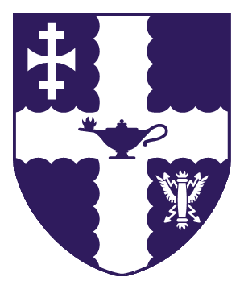
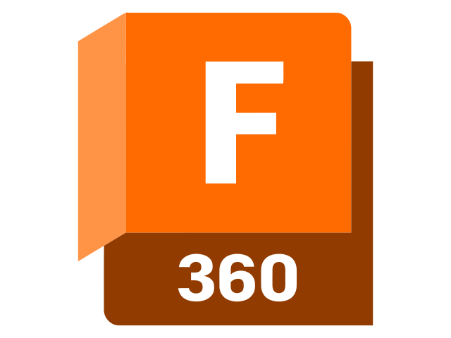
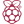
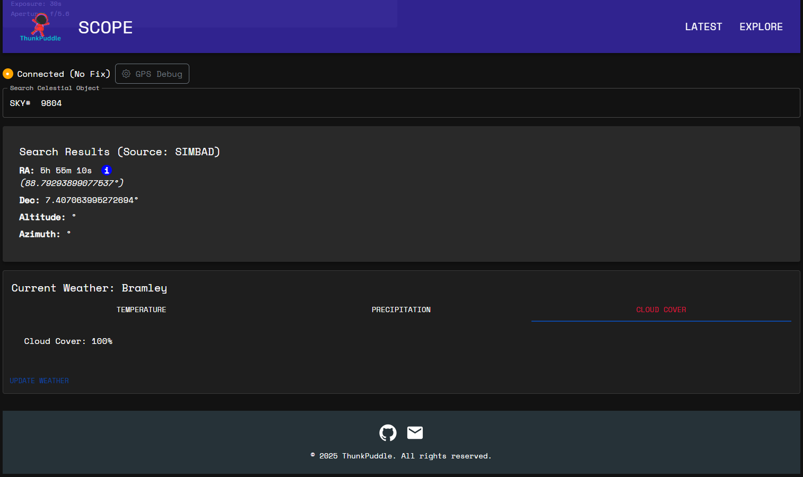
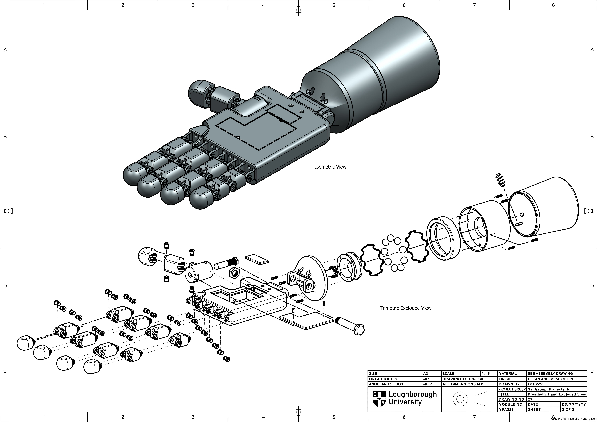
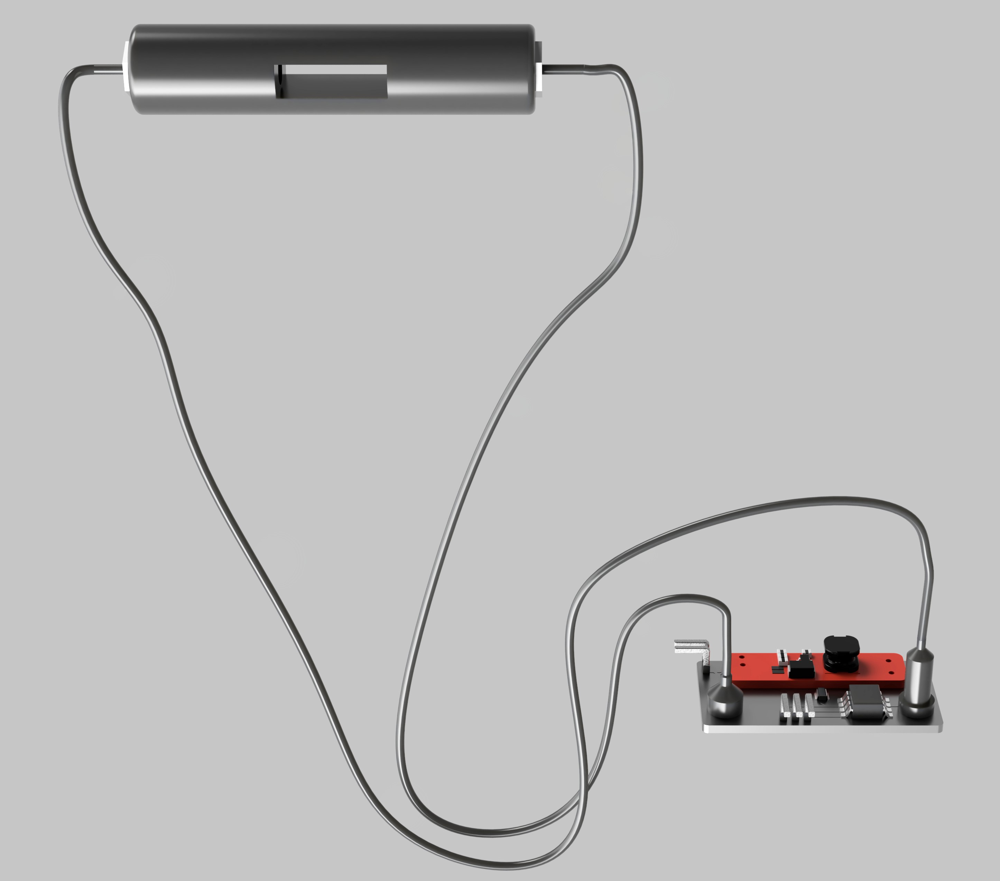

<!-- Replace placeholders (like [Your Name] and image URLs) with your actual details -->

<h1 style="display: flex; align-items: center; gap: 10px;">
  Hi, I'm Daniel Rokadia
  
  
  
</h1>

## About Me

- 🎓 **Masters in Bioengineering at Loughborough University** 

- 💻 **Programming:** C++, Python, LaTeX, Web dev. suite with REACT
- 🔌 **Hardware & Electronics:** Arduino, ESP32, FPGAs, Raspberry Pi
- 🛠 **Specializations:** Embedded Systems, Control Automation, Sensor Design
- 🌱 **Interests:** Astronomy, innovative tech, interdisciplinary research

**Languages & Programmes**

  
  
  
  
  
  
  
  
  
  <!-- Add additional icons as needed -->

---

## Featured Hobby Projects🔎

### **SCOPE: Remote Telescope Controller & Celestial Data Explorer 🔭**

An API-first system that automates telescope positioning and offers a rich, interactive interface for exploring celestial objects. Key features include:

- **Dynamic Data Retrieval:** Uses Astropy, SIMBAD, and VizieR to fetch data for both solar system and deep-sky objects.
- **Real-Time GPS & Weather:** Integrates a DFRobot TEL0137 GPS module and OpenWeatherMap data for live updates.
- **Modern Frontend:** Built with React and Material‑UI for a responsive, user-friendly experience.

  

## **Bioengineering 🧬⚕️🔧**

### 🦿 Prosthetics & Implants

University projects working on developing prosthetic hand in Siemens NX11.

### Biosensors

Industrial development of novel spectrophotometric biosensor for bacteria.

For more info click <a href="DIS_Poster.pdf" download>here</a>.

---

## What I'm Working On 🚀

- **Astronomical Instrumentation:** Currently focused on refining SCOPE for more robust remote telescope control and celestial data exploration. Hoping to next integrate plate Solving for real time celestial alignment.
- **Wear Simulator Rig for Total Elbow Arthroplasty Prostheses:** Designing as part of MEng final year GDP a wear simulator for total elbow implants.
- **Submersible ROV:** Design and build of a submersible ROV with a SDR communications protocol and US for diving in the pipeline.

---
